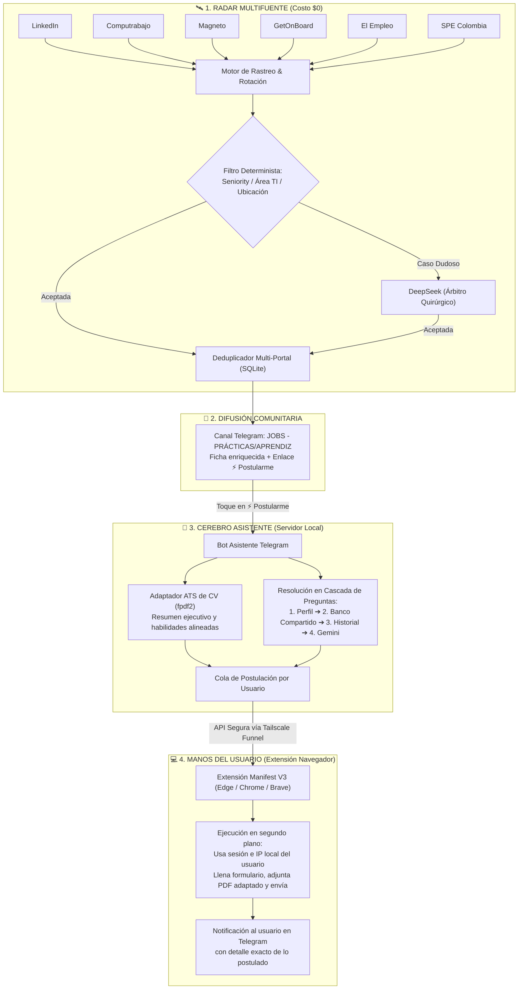

<p align="center">
  
</p>

<h1 align="center">APOLO TI 🏹⚡</h1>

<p align="center">
  <b>Radar Inteligente de Oportunidades & Copiloto Autónomo de Postulación en 1 Toque</b><br>
  <i>Especializado en prácticas, aprendices (incluido SENA / ADSO) y roles junior de TI en Colombia y Remoto LATAM.</i>
</p>

<p align="center">
  
  
  
  
  
  
</p>

---

## 💡 ¿Qué es APOLO TI?

> **APOLO TI** elimina las dos mayores barreras para el talento tecnológico emergente: la saturación de ofertas con requisitos irreales y la lentitud al postular. Su motor determinista rastrea continuamente 6 portales líderes, filtra el seniority falso y arbitra casos dudosos con IA. Cuando el candidato pulsa **⚡ Postularme**, el ecosistema adapta su CV a formato ATS, responde los formularios de filtro y ejecuta la postulación en segundo plano desde su propio navegador bajo una estricta arquitectura Zero-Trust.

En el competitivo mercado de tecnología para perfiles iniciales (**practicantes universitarios, aprendices SENA y desarrolladores junior**), existen dos barreras críticas:
1. **El ruido en los portales:** Vacantes catalogadas como "junior" que exigen años de experiencia previa, o plazas de pasantía que no corresponden a roles reales de ingeniería/TI.
2. **La ventana de tiempo:** En ofertas de prácticas y primeros empleos, **el primero en postular tiene una ventaja decisiva**. Llenar manualmente los mismos formularios y adaptar la hoja de vida una y otra vez genera una fricción agotadora.

**APOLO TI** transforma este proceso en un flujo continuo y automatizado de punta a punta:
- **Rastreo continuo (Radar):** Escanea 6 portales de empleo cada 30 minutos sin usar costosos agentes LLM.
- **Filtros deterministas + Árbitro IA:** Descarta de forma matemática ofertas fuera de perfil y consulta a DeepSeek únicamente para arbitrar casos dudosos con coste mínimo.
- **Canal de alertas en Telegram:** Publica fichas curadas al instante con un botón de acción directa: **`⚡ Postularme`**.
- **Copiloto de postulación Zero-Trust:** Con un solo toque, adapta tu CV en formato ATS (sin inventar datos), resuelve las preguntas filtro mediante una cascada inteligente y ejecuta la postulación en segundo plano **desde tu propio navegador y con tu sesión activa**, sin que el servidor toque jamás tus contraseñas.

---

## 🏛️ Arquitectura del Sistema



---

## ⚡ Características Principales

### 🛰️ 1. Radar Autónomo Determinista
- **6 Fuentes Integradas:** LinkedIn, Computrabajo, El Empleo, Magneto, GetOnBoard y el Servicio Público de Empleo (SPE).
- **Cero Spam y Cero Duplicados:** Huella digital única que impide duplicar la misma vacante aunque aparezca en diferentes portales con enlaces distintos.
- **Rotación y Presupuesto de Requests:** Pausas aleatorias inteligentes, cooldowns escalonados ante bloqueos y límites por fuente.
- **Árbitro IA Eficiente:** DeepSeek clasifica exclusivamente ofertas ambiguas (p. ej., prácticas no técnicas con funciones secundarias de software).
- **Diagnóstico y Resumen Diario:** Detección determinista de incidentes, reporte automático de salud a `healthchecks.io` y resumen métrico a las 08:00 AM.

### 🤖 2. Asistente y Adaptador de CV
- **Lectura Inteligente de CV:** Onboarding mediante el bot de Telegram; Gemini extrae y estructura habilidades, proyectos, experiencia y formación.
- **Adaptación Quirúrgica ATS:** Reordena hasta 6 habilidades clave, ajusta el resumen profesional y homologa hasta 3 términos de la vacante. **Nunca inventa experiencia ni adultera datos reales.** Genera un PDF ATS limpio con tipografía formal (`Liberation Sans`).
- **Resolución de Preguntas en Cascada:**
  1. Perfil directo del usuario.
  2. Banco de preguntas compartidas del sistema.
  3. Respuestas aprendidas de postulaciones anteriores.
  4. Inferencia con la clave de Gemini del propio usuario (plan gratuito).
- **Paquete de Respaldo:** Si la oferta es de un portal externo o manual (p. ej., LinkedIn o GetOnBoard), entrega un paquete listo para copiar y pegar (respuestas, carta de presentación y PDF adaptado).

### 🛡️ 3. Extensión de Navegador Zero-Trust
- **Ejecución Local:** La extensión corre en Microsoft Edge, Google Chrome o Brave. La postulación se emite desde la máquina, la IP y la sesión abierta del candidato.
- **Zero Credenciales:** El servidor **nunca** conoce ni solicita contraseñas o tokens de sesión de los portales de empleo.
- **Selectores Dinámicos:** Si Computrabajo o Magneto modifican su HTML, los selectores se actualizan en el servidor sin requerir una nueva versión de la extensión en la tienda.
- **Manejo Ético de Verificaciones:** Si surge un CAPTCHA, la extensión se detiene y notifica al usuario para resolverlo manualmente.
- **Privacidad y Legalidad:** Autorización explícita de tratamiento de datos personales bajo la **Ley 1581 de Colombia (Habeas Data)**. Borrado integral con comando `/borrarme`.

---

## 📦 Instalación y Configuración

### Requisitos Previos
- **Python 3.12+**
- Gestor de paquetes **[uv](https://docs.astral.sh/uv/)**

### 1. Clonar y Preparar el Entorno
```bash
# Sincronizar el entorno base del buscador
uv sync

# Para habilitar el Asistente de Postulación (Bot, FastAPI, PDF y Cifrado)
uv sync --group asistente

# Para desarrollo y pruebas
uv sync --group dev
```

### 2. Configurar Secretos (`.env`)
Copia la plantilla y asigna los permisos necesarios:
```bash
cp .env.example .env
chmod 600 .env
```

Variables clave requeridas:
```ini
TELEGRAM_BOT_TOKEN="tu_token_de_bot_de_telegram"
TELEGRAM_CHAT_ID="-100xxxxxxxxxx"         # Canal de producción
TELEGRAM_CHAT_ADMIN="-100zzzzzzzzzz"        # Grupo de administración: resumen diario y avisos
TELEGRAM_CHAT_PRUEBA="-100yyyyyyyyyy"      # Chat/grupo de pruebas
DEEPSEEK_API_KEY="sk-..."                 # Para clasificación de dudosas y reportero
HEALTHCHECK_URL="https://hc-ping.com/..." # Opcional: monitoreo de latido

# Requerido para el Asistente:
ASISTENTE_CLAVE_CIFRADO="..."             # Generar con: uv run buscador.py asistente generar-clave
```

---

## 🚀 Modos de Ejecución

### 📡 Operación del Radar / Buscador
```bash
# Corrida periódica estándar (la que ejecuta systemd cada 30 min)
uv run buscador.py

# Simulación en seco sin realizar envíos ni modificar la base de datos
uv run buscador.py --dry-run

# Probar una fuente específica en seco
uv run buscador.py --dry-run --fuente getonboard

# Marcar vacantes actuales como ya vistas (inicialización obligatoria en bases limpias)
uv run buscador.py --seed

# Envío de prueba hacia el chat de testeo
uv run buscador.py --chat-prueba

# Resumen diario matutino (estadísticas, recomendaciones y métricas)
uv run buscador.py resumen

# Simular incidentes para verificar alertas del reportero
uv run buscador.py --simular-incidente linkedin:bloqueo --dry-run
```

| Modo | Envía a Telegram | Registra Vistas | Invoca IA | Requiere Secretos |
|---|:---:|:---:|:---:|:---:|
| `--dry-run` | ❌ No | ❌ No | ❌ No | ❌ No |
| `--seed` | ❌ No | ✅ Sí | ❌ No | ❌ No |
| `--chat-prueba` | ✅ Al chat test | ✅ Sí | ✅ Sí | ✅ Sí |
| `normal` | ✅ Al canal | ✅ Sí | ✅ Sí | ✅ Sí |
| `resumen` | ✅ Al canal | ❌ No | ✅ Sí (1 llamada) | ✅ Sí |

---

### 🤖 Operación del Asistente de Postulación
```bash
# 1. Generar la clave maestra de cifrado (guardar en .env como ASISTENTE_CLAVE_CIFRADO)
uv run buscador.py asistente generar-clave

# 2. Iniciar el servicio completo (Bot de Telegram + API FastAPI + Tareas periódicas)
uv run buscador.py asistente servicio

# 3. Obtener el enlace de postulación ⚡ para pruebas con una vacante
uv run buscador.py asistente enlace computrabajo:ABC12345

# 4. Recargar selectores dinámicos de los portales desde el servidor
uv run buscador.py asistente selectores recargar

# 5. Rotar la clave de cifrado de la base de datos
uv run buscador.py asistente rotar-clave --nueva <CLAVE_NUEVA>
```

---

### 🧩 Instalación de la Extensión del Navegador

1. Abre tu navegador basado en Chromium (**Microsoft Edge**, **Google Chrome** o **Brave**).
2. Dirígete a la gestión de extensiones (`edge://extensions` o `chrome://extensions`).
3. Activa el **Modo de desarrollador** (Developer mode).
4. Haz clic en **Cargar extensión sin empaquetar** (*Load unpacked*).
5. Selecciona la carpeta `extension/` de este repositorio.
6. Abre el popup de la extensión y pulsa en **Vincular**. El bot de Telegram te enviará el enlace de enlace seguro en 1 toque.

---

## 📂 Estructura del Proyecto

```
JobScrapper_TG/
├── buscador.py                     # Punto de entrada principal (CLI de uv)
├── config.yaml                     # Configuración funcional (fuentes, filtros, límites)
├── pyproject.toml                  # Dependencias y configuración de herramientas
├── assets/                         # Recursos gráficos y certificados
│   ├── logo.jpg                    # Logotipo e identidad visual de APOLO TI
│   ├── certs/                      # Certificado intermedio del SPE (TLS)
│   ├── fuentes/                    # Tipografías oficiales para generación de PDF (Liberation Sans)
│   └── selectores/                 # Selectores dinámicos JSON para Computrabajo y Magneto
├── buscador_vacantes/              # Núcleo del sistema
│   ├── corrida.py                  # Orquestador del flujo y CLI del buscador
│   ├── filtros.py                  # Reglas deterministas de filtrado (seniority, áreas, nivel)
│   ├── clasificador.py             # Clasificación de vacantes dudosas con DeepSeek
│   ├── estado.py                   # Persistencia en SQLite (data/vacantes.db)
│   ├── formato.py                  # Generación de mensajes HTML para Telegram
│   ├── publicacion.py              # Envío al canal y control de encabezados
│   ├── reportero.py                # Diagnóstico y reporte automático de incidentes
│   ├── resumen.py                  # Generador de métricas y resumen diario
│   ├── fuentes/                    # Conectores modulares por portal
│   │   ├── base.py                 # Clase abstracta e interfaz de fuentes
│   │   ├── computrabajo.py         # Conector Computrabajo
│   │   ├── elempleo.py             # Conector El Empleo
│   │   ├── getonboard.py           # Conector GetOnBoard
│   │   ├── linkedin.py             # Conector LinkedIn
│   │   ├── magneto.py              # Conector Magneto
│   │   └── spe.py                  # Conector Servicio Público de Empleo
│   └── asistente/                  # Plataforma del Copiloto de Postulación
│       ├── bot.py                  # Bot interactivo multiusuario de Telegram
│       ├── api.py                  # API FastAPI para la extensión (Tailscale Funnel)
│       ├── cv_pdf.py               # Renderizado del CV adaptado en PDF ATS (fpdf2)
│       ├── cv_adaptado.py          # Lógica de alineación sin inventar datos
│       ├── respuestas.py           # Cascada inteligente de resolución de preguntas
│       ├── gemini.py               # Integración segura con Google Gemini
│       ├── cifrado.py              # Cifrado AES-GCM para credenciales de usuario
│       └── cola.py                 # Orquestación de la cola de postulaciones
├── extension/                      # Extensión de navegador Manifest V3
│   ├── manifest.json               # Manifiesto de la extensión
│   ├── servicio.js                 # Service worker de fondo (ejecuta la cola)
│   ├── motor.js                    # Motor de inyección y llenado de formularios
│   ├── popup.html / popup.js       # Interfaz visual de vinculación y estado
│   └── adaptadores/                # Adaptadores por portal (Computrabajo, Magneto)
├── deploy/                         # Unidades systemd y guías de despliegue en servidor
├── docs/                           # Especificaciones técnicas de referencia
└── tests/                          # Suite integral de pruebas (pytest + respx)
```

---

## 🔒 Privacidad y Seguridad

- **Cumplimiento Normativo:** Implementa consentimiento explícito conforme a la **Ley 1581 de 2012** (Colombia).
- **Cifrado de Extremo a Extremo:** Las claves de API de Gemini de los usuarios se almacenan cifradas con clave maestra independiente mediante AES-GCM.
- **Aislamiento de Sesiones:** El servidor jamás solicita, almacena ni gestiona contraseñas o cookies de los portales laborales.
- **Acceso Restringido:** El bot asistente valida automáticamente la membresía activa en el canal privado de Telegram antes de procesar cualquier acción.

---

<p align="center">
  <b>APOLO TI</b> · <i>Construido para acelerar el futuro del talento tecnológico.</i>
</p>
